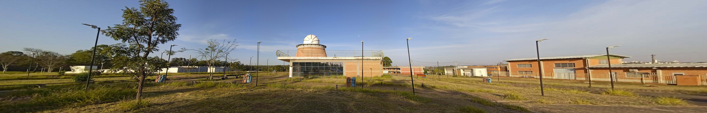
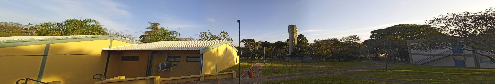

<h1 align="center"> Panoramic Construction with SIFT </h1>
<h3 align="center"> Project Assignment 1</h3>
<h3 align="center"> 1001532 - Computer Vision (2022/1)</h3>
<h4 align="center"> <a href="https://site.dc.ufscar.br/"> DC - Department of Computing</a>  </h4>
<h4 align="center"> <a href="https://www.ufscar.br/">UFSCar - Universidade Federal de São Carlos</a>  </h4>

## 🔵 Introduction
This project stitches images together to create a Panorama. Images are taken from different perspectives and transformed to fit together by using SIFT feature detection and RANSAC algorithm for homography transformations

## 🔵 Requirements

Before you start, make sure you've met the following requirements:
* [Python](https://docs.python.org/3/)
* [OpenCV](https://opencv.org/)

## 🔵 Installing Panoramic Construction with SIFT

* Install requirements
* Import [panorama.py](https://github.com/souzaitor/EnC/blob/d5136434141fad0acd34484b29ca4d97b3cc28b6/2021-1/Computer%20Vision/Panorama/panorama.py)

## 🔵 Using Panoramic Construction with SIFT

* See [example.py](https://github.com/souzaitor/EnC/blob/d5136434141fad0acd34484b29ca4d97b3cc28b6/2021-1/Computer%20Vision/Panorama/example.py) for how use the module

### Panoramic of image set 1

### Panoramic of image set 2

### Panoramic of image set 3

### Panoramic of image set 4

## 🔵 Authors

<table>
  <tr>
    <td align="center">
      <a href="https://github.com/souzaitor">
         
        
          <b>Heitor Souza</b>
        
      </a>
    </td>
    <td align="center">
      <a href="https://github.com/gustavochavari">
         
        
          <b>Gustavo Chavari</b>
        
      </a>
    </td>
  </tr>
</table>

## 🔵 License

This project is under license. Acess the file [LICENSE](https://github.com/souzaitor/EnC/blob/d5136434141fad0acd34484b29ca4d97b3cc28b6/LICENSE) for more details.

## 🔵 References

* [Introduction to SIFT (Scale-Invariant Feature Transform) ](https://docs.opencv.org/4.x/da/df5/tutorial_py_sift_intro.html)

* 📄 LOWE, David G. [**Distinctive Image Features from Scale-Invariant Keypoints**](https://www.cs.ubc.ca/~lowe/papers/ijcv04.pdf). International Journal of Computer Vision, v. 60, n. 2, p. 91–110, 2004.

* 📄 REY-OTERO, Ives and DELBRACIO, Mauricio. [**Anatomy of the SIFT Method**](https://www.ipol.im/pub/art/2014/82/article.pdf). Image Processing On Line, 2014.

* 📽️ [SIFT Detector | SIFT Detector](https://www.youtube.com/watch?v=ram-jbLJjFg&list=PL2zRqk16wsdqXEMpHrc4Qnb5rA1Cylrhx&index=16&ab_channel=FirstPrinciplesofComputerVision)

* [OpenCV: Feature Matching + Homography to find Objects ](https://docs.opencv.org/3.4/d1/de0/tutorial_py_feature_homography.html)

*  📄 D. Li, D. Han, X. Zhang and L. Zhang, [**Panoramic image mosaic technology based on SIFT algorithm in power monitoring**](https://ieeexplore.ieee.org/document/9010294), 2019 6th International Conference on Systems and Informatics (ICSAI), 2019, pp. 1329-1333, doi: 10.1109/ICSAI48974.2019.9010294.

* [stackoverflow: how to show the whole image when using opencv warpperspective](https://stackoverflow.com/questions/13063201/how-to-show-the-whole-image-when-using-opencv-warpperspective/20355545#20355545)

<a href="https://github.com/souzaitor/EnC/blob/main/README.md#projects"> ⬅️ Return to projects list</a>

