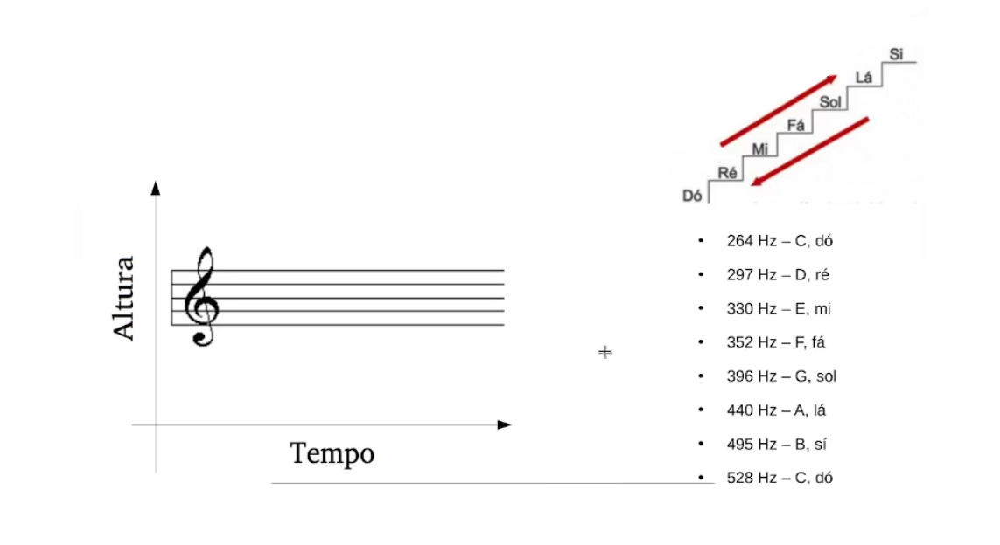

[⬅️ Voltar](https://github.com/souzaitor/Intro-Musical/blob/main/README.md#-notas-de-aula)

# 📖 Tópico 1: Conceitos Introdutórios da Computação Musical

<ul>
 <li><a href="#lei">🎵 Lei das Cordas</a></li>
 <li><a href="#altura">🎵 Altura</a></li>
 <li><a href="#natural">🎵 Escala Natural </a></li>  
 <li><a href="#temperada">🎵 Escala Temperada</a></li> 
 <li><a href="#sen">🎵 Modelo Matemático Senoidal</a></li>
</ul>                     

## 🎵 Lei das Cordas

- Descobrindo as razões matemáticas entre as vibrações (frequências) das cordas e as notas geradas, Pitágoras determino a **Lei das Cordas**: A frequência é inversamente proporcional ao comprimento da corda
- **Oitava**: Uma é o intervalo entre uma nota musical e outra com a metade de sua frequência. Refere-se igualmente como sendo um intervalo musical de 2/1.

(<a href="#top">⬆️ Voltar ao Topo</a>)

## 🎵 Altura

- A vibração regular produz sons de altura definida, chamadas notas musicais
- Dessa forma, definimos nota musical por uma frequência específica
- Em particular, as notas são descritas por meio de sinais (figuras)

- A medida que a frequência **sobe**, a altura **aumenta**.
- Quanto **mais alta** uma nota, **mais agudo** é a sensação da nota. Quanto **mais baixa** uma nota, **mais grave** é a sensação da nota.

(<a href="#top">⬆️ Voltar ao Topo</a>)

## 🎵 Escala Natural

- O **tom** é a soma de dois semitons
- O **semitom** é o menor intervalo adotado entre duas notas (frequências) na música ocidental
- O **coma** é a nona parte de um tom

(<a href="#top">⬆️ Voltar ao Topo</a>)

## 🎵 Escala Temperada

- No sistema Temperado para chegar no Semitom Ascendente (Sustenido) e no Semitom Descendente (Bemol ) são necessários andar 4.5 comas, então nesse caso Sustenido = Bemol

- A escala temperada é dividida em intervalos iguais, i: **dó, dó#, ré, ré#, mi, fá, fá#, sol, sol#, lá, lá#, si**
- Se no intervalo de uma oitava a frequência dobra, podemos escrever: 
- **valor de i = 1.012918**

(<a href="#top">⬆️ Voltar ao Topo</a>)

## 🎵 Modelo Matemático Senoidal

- A **onda senoidal** é a forma mais simples de sinal (função) periódica que permite explicar as propriedades percentuais do som, como a altura, intensidade, timbre, inclusive aspectos mais complexos como harmônicos
- Portanto, um modelo matemático para descrever o som pode ser construído com base em funções senoidais.

- A **amplitude**, igual ao raio da circunferência geradora, determina a **potência** sonora entre pelo sinal ( potência é a energia por unidade de tempo e mede-se em watts)
- A amplitude é um **parâmetro físico**, a intensidade representa a **percepção** da amplitude da vibração sonora e permite distinguir sons fortes de sons fracos.
- Enquanto **amplitude** e **potência** são conceitos físicos, **intensidade**, assim como **altura**, é um conceito psicofísico.
- A percepção do ouvido não é linear em relação à potência (amplitude ao quadrado)
- A intensidade (medida em dB - decibéis) de um som é dada por, sendo Po o **som de referência**:  

- Por exemplo, para produzir um som de intensidade duas vezes maior, é preciso utilizar cerca de 10 vezes mais potência acústica

(<a href="#top">⬆️ Voltar ao Topo</a>)

