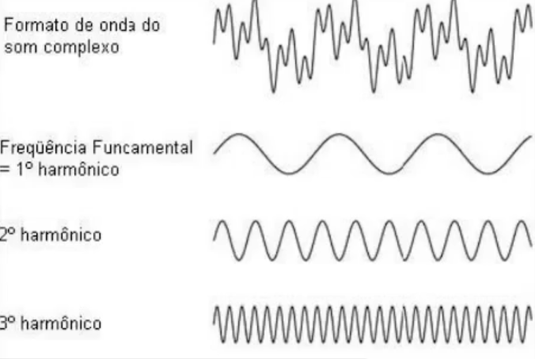

[⬅️ Voltar](https://github.com/souzaitor/Intro-Musical/blob/main/README.md#-notas-de-aula)

# 📖 Tópico 2: Notas e Séries Harmônicas

<ul>
 <li><a href="#notas">🎵 Notas e Séries Harmônicas</a></li>
 <li><a href="#harm">🎵 Os Harmônicos</a></li>
 <li><a href="#tim">🎵 O Timbre </a></li>  
</ul>                     

# 🎵 Notas e Séries Harmônicas

- Anteriormente, com base nas características de uma onda sonora, um modelo baseado na função seno foi proposto para descrever uma nota musica com uma única frequência.
- Como exemplo, considerando uma frequência f0 de 440 Hz e amplitude A, um sinal sonoro, ou melhor, **uma nota musica,** pode ser representado, de forma simplificada, como:

sendo que  é a frequência angular e f0 é chamada frequência fundamental

- Temos um problema nesse modelo ao caracterizar o timbre de maneira mais adequada, o modelo precisa ser aperfeiçoado para incorporar outras frequências
- Estas novas frequências são chamadas harmônicos

## 🎵 Os Harmônicos

- Baseados na teoria de **Análise de Fourier**, podemos descrever um sinal sonoro ou nota musical como:

- Em sons complexos, a componente de frequência mais baixa (componente fundamental) é normalmente percebida como a altura do som e é considerada o primeiro harmônico (tom fundamental)
- As demais componentes de frequência (múltiplos da frequência fundamental), determinam o timbre da fonte sonora

## 🎵 O Timbre

- Terceira propriedade percentual do som, o timbre, é a que permite diferenciar sons de mesma frequência oriundos de fontes diferentes
- Grosso modo, o timbre corresponde ao conjunto de frequência que um instrumento consegue produzir
- O timbre é relacionado com a forma do sinal sonoro

- Formas complexas de vibração sonora, músicas por exemplo. podem ser geradas como combinações de ondas senoidais com diferentes frequências, baseada na teoria da **Transformada de Fourier.**
