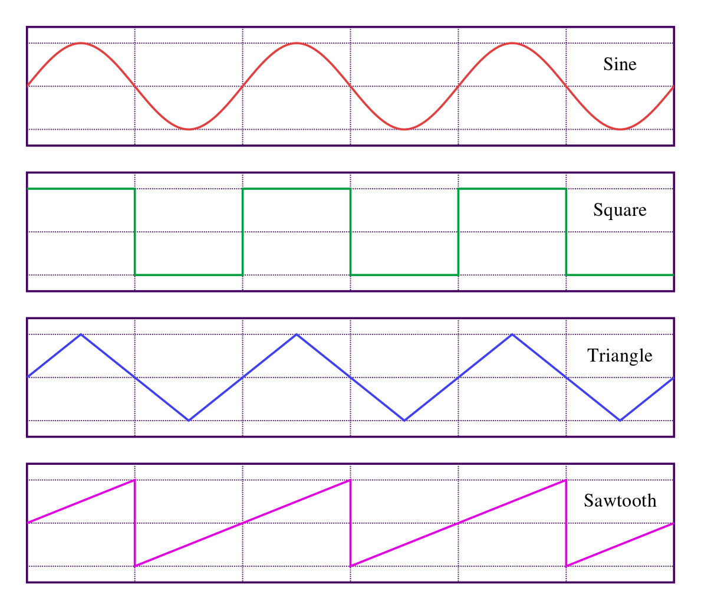
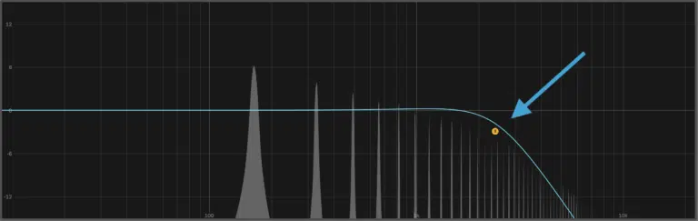
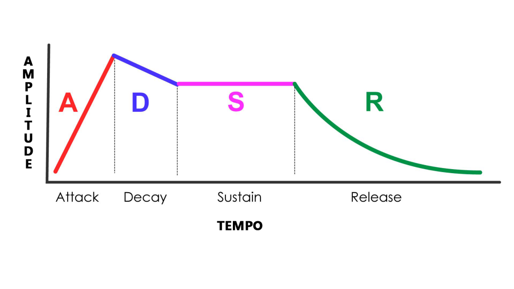
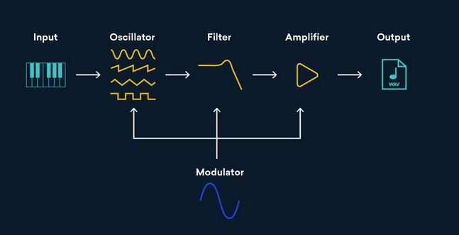
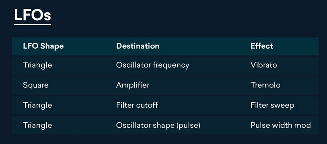

[⬅️ Voltar](https://github.com/souzaitor/Intro-Musical/blob/main/README.md#-notas-de-aula)

# 📖 Tópico 3: Síntese de Sons 

<ul>
 <li><a href="#t1">🎵 Formas de Ondas Básicas</a></li>
 <li><a href="#t2">🎵 Filtros</a></li>  
 <li><a href="#t4">🎵 Envelopes</a></li>  
 <li><a href="#t5">🎵 Síntese Subtrativa</a></li> 
 <li><a href="#t3">🎵 Referências </a></li>  
</ul>                     

# 🎵 Formas de Ondas Básicas

- **Ondas senoidais** são o bloco fundamental para criar sons, podem ser combinadas para sons mais complexos por meio da **sínteses aditiva**.
- **Onda triangulares** são mais nítidas que onda senoidais; São criadas somando ondas senoidais com múltiplos pares da frequência fundamental, a amplitude de cada nova frequência é o inverso quadrado do multiplicador.
- **Onda quadradas** são mais ricas e barulhentas que onda senoidais; São criadas somando ondas senoidais com múltiplos pares da frequência fundamental, a amplitude de cada nova frequência é o inverso matemático do multiplicador.
- **Ondas dente de serra** são as mais barulhentas por serem as mais ricas em harmônicos; São criadas somando ondas senoidais com múltiplos ímpares da frequência fundamental, a amplitude de cada nova frequência é o inverso matemático  do multiplicador.
- Essas ondas são criadas por **osciladores**, a parte de um sintetizador que cria sons. Produzem sinais eletrônicos que vibram como cordas vocais.
- Na **Síntese aditiva** nos adicionamos formas de ondas simples com diferentes frequências e amplitudes, tocadas por um ou mais osciladores, para essencialmente criar **qualquer som**. Combinando osciladores podemos somar diferentes ondas.

(<a href="#top">⬆️ Voltar ao Topo</a>)

# 🎵 Filtros

- O filtro passa altas (**high pass filter**, HPF ou HP), a medida que se move permite que as frequências altas passem enquanto corta as frequências baixas.
- O filtro passa baixas(**low pass filter**, LPF ou LP), a medida que se move permite que as frequências baixas passem enquanto corta as frequências altas.
- Filtros passa altas e baixas podem ser usadas por um **síntese subtrativa** para também criar novos sons interessantes.
- Aumentar a ressonância nesses filtros aumenta volume para as frequências diretamente sobre ou próximas ao ponto de corte, o ponto que corta as frequências

(<a href="#top">⬆️ Voltar ao Topo</a>)

# 🎵 Envelopes

- Em som e música, um envelope descreve como um som muda ao longo do tempo.
- Os parâmetros de envelopes são ADSR:
    - **Attack** é o tempo necessário para o aumento inicial do som de zero ao pico, começando quando a tecla é pressionada.
    - **Decay** é o tempo necessário para a descida subsequente do nível de **Attack** até o nível de **Sustain**.
    - **Sustain** é o nível durante a sequência principal da duração do som, até que a tecla seja solta.
    - **Release** é o tempo necessário para que o nível decaia do nível de **Sustain** para zero após a tecla ser solta.
    - Enquanto **Attack** , **Decay** e **Release** referem-se ao tempo, **Sustain** refere-se ao nível
- Os parâmetros ADSR podem ser aplicados sobre os filtros e sobre o pitch para também gerarem outros tipos de sons.

(<a href="#top">⬆️ Voltar ao Topo</a>)

# 🎵 Síntese Subtrativa

* A síntese subtrativa é uma forma de síntese em que partes de um sinal rico em harmônicos são atenuadas com um filtro. Ao filtrar certas frequências de uma forma de onda básica, você pode esculpir o som ao seu gosto.
* Você também pode usar o envelope ADSR para moldar como o som aumenta e diminui.
* Pode-se pensar na síntese subtrativa como uma escultura: você começa com uma laje de pedra e termina com uma escultura removendo as partes que não quer

## 🎵 Passos da Síntese Subtrativa

* Escolher uma forma de onda dependendo do som inicial que se deseja em um oscilador 
* Vários osciladores podem ser adicionados para se criar um som rico
* Um dos primeiros passos que podemos dar para esculpir nosso som é filtrar, frequências especificas podem ser selecionadas dependendo do tipo do filtro utilizado (passa baixas, altas, bandas, etc)
* Conforme você ajusta seu filtro, você também pode brincar com a ressonância para acentuar as frequências em torno do ponto de corte
* Em seguida, ajustar o envelope ADSR permite moldar a amplitude (ou volume) do seu som ao longo do tempo
* LFO significa um oscilador de baixa frequência e leva o nome de sua frequência que fica abaixo de 20 Hz, semelhante a um envelope, um LFO é atribuído a outro parâmetro para controlá-lo 
* Exemplos de efeitos que podem ser criadoos:

(<a href="#top">⬆️ Voltar ao Topo</a>)

# Referências

* [📕 Sound Design Basics: Subtractive Synthesis](https://cymatics.fm/blogs/production/subtractive-synthesis)

* [📕 Subtractive Synthesis: The Complete Guide for Music Producers (2022)](https://www.edmprod.com/subtractive-synthesis/)

* [📕 Subtractive Synthesis: Learn Synthesizer Sound Design](https://blog.landr.com/subtractive-synthesis/)

* [▶️ What's Synthesis and Sound Design? Part 1: Oscillators & Waveforms (Music Theory)](https://www.youtube.com/watch?v=qV10Gb-Dvao&feature=youtu.be&ab_channel=DaveWave)

* [▶️ What's Synthesis and Sound Design? Part 2: Subtractive Synthesis & Filters (Music Theory)](https://www.youtube.com/watch?v=In23B9qZhI8&ab_channel=DaveWave)

* [▶️ What's Synthesis and Sound Design? Part 3: Envelopes & ADSR (Music Theory)](https://www.youtube.com/watch?v=n-k0NQ5lcSA&ab_channel=DaveWave)

* [▶️ Sound Design and Synth Fundamentals](https://www.youtube.com/watch?v=NJLIS2MkFe4&feature=youtu.be&ab_channel=InTheMix)

(<a href="#top">⬆️ Voltar ao Topo</a>)
